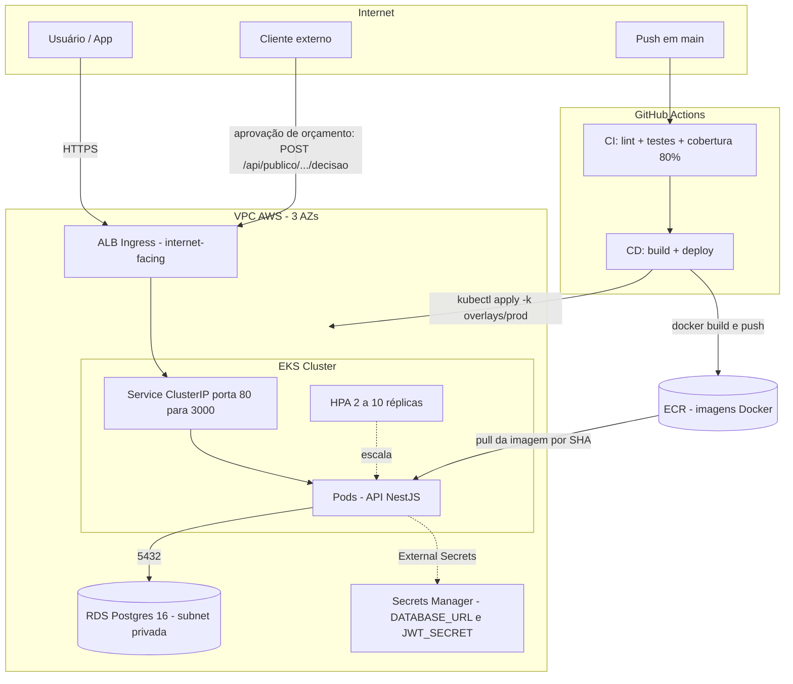

# Tech Challenge — Sistema de Oficina Mecânica

Back-end em **NestJS** (TypeScript) para o MVP de um **Sistema Integrado de Atendimento e Execução de Serviços Automotivos**, organizado em **Domain-Driven Design (DDD)**.

> **Fase 1** entregou a API DDD com autenticação, regras de domínio da Ordem de Serviço e testes. **Fase 2** (abaixo) leva a aplicação para a nuvem: Kubernetes (EKS), Infraestrutura como Código (Terraform) e CI/CD (GitHub Actions). A documentação da Fase 1 segue íntegra após a seção da Fase 2.

## Fase 2 — Kubernetes, Infraestrutura como Código e CI/CD

> 🎥 **Vídeo demonstrativo:** _a definir_ — o link do YouTube (não listado) será adicionado aqui **antes da entrega**.

A Fase 2 leva a API para um ambiente **cloud-native** na AWS: a aplicação roda em **Kubernetes gerenciado (EKS)** com escalabilidade automática, banco gerenciado (**RDS Postgres 16**), imagens versionadas no **ECR** e segredos no **Secrets Manager** — tudo provisionado por **Terraform** e entregue por **GitHub Actions** (CI + CD).

### Objetivos da fase

- **Conteinerização e deploy em Kubernetes** com manifestos versionados (Kustomize: base + overlays `dev`/`prod`).
- **Escalabilidade dinâmica** em horários de pico via **HPA** (2 → 10 réplicas; CPU 70% / memória 80%).
- **Infraestrutura reproduzível** com **Terraform** (VPC, EKS, RDS, ECR, Secrets Manager).
- **Pipeline automatizado e completo**: **CI** (lint + testes + cobertura ≥ 80%) e **CD** que faz **build + deploy de verdade** — verificado por `kubectl rollout status` e smoke test em `/api/health` — visível no histórico do GitHub Actions. O CD entrega em um cluster **Kubernetes (kind) efêmero criado no próprio runner** (não exige AWS); o alvo de **produção** é o **EKS/RDS/ECR** descrito em [`infra/`](infra/) (Terraform).
- **Endpoint público de saúde** (`/api/health`) para os probes do K8s e o `HEALTHCHECK` do Docker.
- **Endpoint público de aprovação de orçamento** para o cliente externo, sem autenticação: `POST /api/publico/os/:numero/orcamento/decisao` (consulta em `GET /api/publico/os/:numero/orcamento`).

### Arquitetura (Fase 2)



> O diagrama acima é renderizado nativamente pelo GitHub (Mermaid) e é a fonte canônica da arquitetura da Fase 2.

### Componentes provisionados

| Camada | O que é | Onde está |
| --- | --- | --- |
| Rede | VPC dedicada (3 AZs, subnets pública/privada, 1 NAT) | [`infra/vpc.tf`](infra/vpc.tf) |
| Compute | EKS + node group `t3.medium` (2→5), IRSA | [`infra/eks.tf`](infra/eks.tf) |
| Banco | RDS Postgres 16 `db.t3.micro` (subnet privada) | [`infra/rds.tf`](infra/rds.tf) |
| Imagens/Segredos | ECR + Secrets Manager (`DATABASE_URL`, `JWT_SECRET`) | [`infra/ecr.tf`](infra/ecr.tf), [`infra/secrets.tf`](infra/secrets.tf) |
| App no cluster | Deployment (initContainer de migrations), Service, Ingress ALB, HPA | [`k8s/base/`](k8s/base) |
| Deploy local (CD) | Overlay para cluster `kind` (Postgres no cluster, sem Ingress ALB) | [`k8s/overlays/ci/`](k8s/overlays/ci) |
| Pipeline | CI (`ci.yml`) e CD (`cd.yml`, deploy em `kind` no runner) | [`.github/workflows/`](.github/workflows) |

### Como executar (Fase 2)

**1. Local (Docker) — para desenvolvimento e testes rápidos:**

```bash
cp .env.example .env
npm run docker:up
# API em http://localhost:3000/api · Swagger em http://localhost:3000/api/docs
```

**2. Kubernetes (Kustomize) — sobre um cluster existente:**

```bash
kubectl apply -k k8s/overlays/dev    # ambiente de desenvolvimento
kubectl apply -k k8s/overlays/prod   # produção
```

**3. Infraestrutura (Terraform) — provisiona a stack na AWS:**

Passo a passo completo (variáveis, custo estimado, `init/plan/apply/destroy`, kubeconfig) em **[`infra/README.md`](infra/README.md)**.

### Links

- **Swagger / OpenAPI:** `/api/docs` (rota pública da documentação interativa).
- **Operação da infraestrutura:** [`infra/README.md`](infra/README.md).
- **Notificações por email (mock + estratégia de swap):** ver a seção [Notificações por email](#notificações-por-email) abaixo — o `ConsoleEmailProvider` é trocado por um provider real (SMTP/SES) apenas reconfigurando o binding no `InfrastructureModule`, sem tocar em `domain`/`application`.

---

> A partir daqui segue a documentação da **Fase 1** (mantida na íntegra).

## Tecnologias

- **Node.js 20** / **TypeScript 5** (strict)
- **NestJS 10** — framework modular
- **PostgreSQL 16** + **Prisma 5**
- **JWT** (`@nestjs/jwt` + Passport) + **bcryptjs**
- **class-validator** / **class-transformer**
- **Swagger** (`@nestjs/swagger`)
- **Jest** + **Supertest**
- **Docker** / **Docker Compose**

## Justificativa Técnica — PostgreSQL

O **PostgreSQL 15+** foi escolhido como banco de dados do sistema por aderência direta às características do domínio: a Ordem de Serviço é um agregado relacional que cruza cliente, veículo, serviços e peças, e operações como o fechamento da OS exigem atualizações atômicas (baixa de estoque, cálculo de orçamento e mudança de status em uma única transação).

### Motivos da escolha

1. **Transações ACID completas** — garantem que operações multi-entidade (fechar OS, baixar estoque, atualizar total) ocorram de forma atômica, com rollback automático em caso de falha.
2. **Integridade referencial nativa** — Foreign Keys impedem, no nível do banco, estados inválidos como uma OS sem cliente ou referenciando peça inexistente, reforçando as invariantes do modelo DDD.
3. **Precisão monetária com `DECIMAL`** — valores de peças, serviços e total da OS são armazenados sem erros de arredondamento, ao contrário do que ocorreria com `FLOAT`.
4. **Enums nativos** — o ciclo de vida da OS (`RECEBIDA`, `EM_EXECUCAO`, `FINALIZADA`, etc.) é restrito no banco, prevenindo valores inválidos.
5. **Consultas analíticas robustas** — funções como `AVG` e `EXTRACT` atendem nativamente ao requisito de monitoramento de tempo médio de execução, sem ferramentas externas.
6. **Integração de primeira classe com Prisma ORM** — migrações automáticas, type safety com TypeScript e `prisma.$transaction` alinhado às garantias ACID.

### Por que não as alternativas

- **MongoDB**: o domínio é fortemente relacional (5+ entidades por OS); `$lookup` e a ausência de FKs nativas tornariam o modelo frágil e mais lento.
- **MySQL**: viável, porém o PostgreSQL oferece melhor suporte a tipos avançados, conformidade SQL mais rigorosa e performance superior em queries analíticas.
- **SQLite**: inadequado para concorrência e produção.

A escolha garante consistência transacional, integridade dos dados e alinhamento direto com o modelo de domínio definido.

## Arquitetura

Monolito modular DDD com dependência estritamente para dentro: `modules → application → domain` e `infrastructure → domain` (o domínio não conhece NestJS nem Prisma).

```
src/
├── domain/           # Entidades, value objects, eventos e interfaces de repositório (puro)
├── application/      # Use cases (@Injectable) que orquestram o domínio
├── infrastructure/   # PrismaService, repositórios, auth (JWT, bcrypt), eventos
├── modules/          # Módulos NestJS: controllers, DTOs e wiring de providers
└── common/           # Guards, decorators, filters, interceptors, tokens de DI
```

Bounded contexts: **cliente**, **veículo**, **serviço**, **insumo** e **ordem-de-servico** (agregado raiz com `ItemOrcamento` e `ExecucaoDeServico`).

Guards globais (`JwtAuthGuard` + `RolesGuard`) deixam todas as rotas autenticadas por padrão — exceções são marcadas com `@Public()` e o controle por perfil usa `@Roles(PerfilAcesso.X)`. Violações de invariantes do domínio levantam `DomainError` e são traduzidas para **HTTP 422** pelo `DomainExceptionFilter`.

### Notificações por email

O envio de emails (ex.: link do orçamento para o cliente) passa pela interface `EmailProvider` (`src/infrastructure/email/EmailProvider.ts`), injetada via token `INJECTION_TOKENS.EMAIL_PROVIDER`. Na Fase 2 o binding aponta para `ConsoleEmailProvider`, um **mock** que apenas registra a mensagem no log.

Para usar um provider real em produção (SMTP, AWS SES, etc.) **não é preciso tocar em `domain`/`application`**: implemente a interface `EmailProvider` numa nova classe e troque o binding em `InfrastructureModule`, selecionando-o por variável de ambiente. Por exemplo:

```ts
{
  provide: INJECTION_TOKENS.EMAIL_PROVIDER,
  useClass: process.env.EMAIL_PROVIDER === 'ses' ? SesEmailProvider : ConsoleEmailProvider,
}
```

## Como iniciar o projeto

### Opção A — Docker (recomendada)

```bash
cp .env.example .env
npm run docker:up
```

O container `api` aplica `prisma migrate deploy` e roda o seed automaticamente na subida.

- API: http://localhost:3000/api
- Swagger: http://localhost:3000/api/docs
- Postgres: `localhost:5432` (user: `oficina`, senha: `oficina123`)

### Opção B — Local

```bash
npm install
cp .env.example .env
npm run prisma:generate
npm run prisma:migrate
npm run prisma:seed
npm run start:dev
```

### Variáveis de ambiente

Definidas em `.env.example`: `DATABASE_URL`, `JWT_SECRET`, `JWT_EXPIRES_IN` (padrão `8h`), `PORT` (padrão `3000`), `NODE_ENV`.

### Usuários criados pelo seed

| Email                     | Perfil        | Senha      |
| ------------------------- | ------------- | ---------- |
| `admin@oficina.local`     | ADMINISTRADOR | `admin123` |
| `atendente@oficina.local` | ATENDENTE     | `senha123` |
| `mecanico1@oficina.local` | MECANICO      | `senha123` |
| `mecanico2@oficina.local` | MECANICO      | `senha123` |

O seed também popula clientes, veículos, serviços, insumos e ordens de serviço de exemplo (uma em cada status) para facilitar testes manuais.

## Fluxo de uso da API

O passo a passo completo de uso da API ponta a ponta — autenticação, cadastros, criação da OS, aprovação do orçamento, execução e entrega — está documentado em **[`docs/fluxo-completo.pdf`](docs/fluxo-completo.pdf)**. Comece por ele para entender a sequência esperada de chamadas e os perfis envolvidos em cada etapa.

Recursos auxiliares:

- **Swagger interativo** em `/api/docs` — explore e teste as rotas direto no navegador.
- **Coleção HTTP** em [`docs/oficina.http`](docs/oficina.http) — exemplos prontos para o REST Client (VS Code/JetBrains).
- **Diagrama entidade-relacional** em [`docs/diagrama-entidade-relacional.md`](docs/diagrama-entidade-relacional.md).
- **Relatório de scan de vulnerabilidades** em [`docs/scan-report.html`](docs/scan-report.html) — auditoria de segurança das dependências do projeto.

## Testes

```bash
npm test           # unitários (*.spec.ts em src/)
npm run test:cov   # cobertura — mínimo 80% em domain e application
npm run test:e2e   # end-to-end com PrismaService mockado em memória (não exige DB)
```

## Scripts úteis

```bash
npm run start:dev         # API com watch
npm run build             # nest build → dist/
npm run lint              # eslint --fix
npm run prisma:generate   # gera o client após alterar schema.prisma
npm run prisma:migrate    # cria nova migração em dev
npm run prisma:seed       # popula dados iniciais
npm run docker:up         # docker-compose up --build -d
npm run docker:down       # docker-compose down
```

## Licença

Projeto acadêmico — Pós-graduação em Arquitetura de Software (FIAP).
