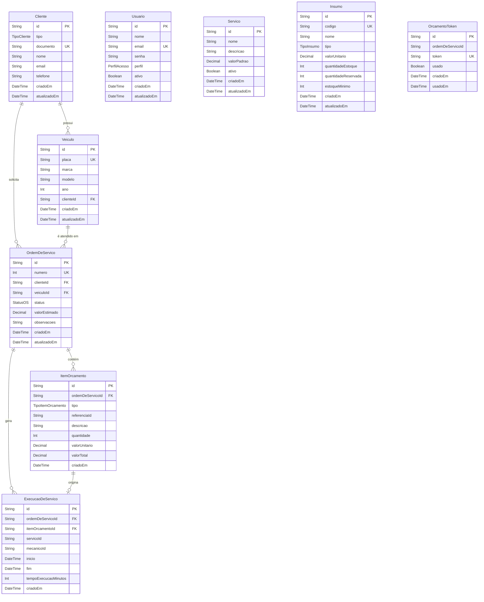

# Diagrama Entidade-Relacionamento

## Enums

| Enum | Valores |
|------|---------|
| **PerfilAcesso** | `ADMINISTRADOR`, `ATENDENTE`, `MECANICO` |
| **StatusOS** | `RECEBIDA`, `EM_DIAGNOSTICO`, `AGUARDANDO_APROVACAO`, `APROVADA`, `REPROVADA`, `EM_EXECUCAO`, `FINALIZADA`, `ENTREGUE` |
| **TipoCliente** | `PF`, `PJ` |
| **TipoInsumo** | `PECA`, `INSUMO` |
| **TipoItemOrcamento** | `SERVICO`, `INSUMO` |

## Descrição dos Relacionamentos

- **Cliente → Veículo**: um cliente pode possuir zero ou mais veículos.
- **Cliente → OrdemDeServico**: um cliente pode ter zero ou mais ordens de serviço.
- **Veículo → OrdemDeServico**: um veículo pode estar em zero ou mais ordens de serviço.
- **OrdemDeServico → ItemOrcamento**: uma OS contém um ou mais itens de orçamento (cascade delete).
- **OrdemDeServico → ExecucaoDeServico**: uma OS pode gerar zero ou mais execuções de serviço (cascade delete).
- **ItemOrcamento → ExecucaoDeServico**: um item de orçamento pode originar no máximo uma execução (relação 1:0..1, cascade delete).
- **OrcamentoToken**: entidade independente que armazena tokens de aprovação/reprovação de orçamento vinculados a uma OS (sem FK declarada no Prisma, referência via `ordemDeServicoId`).
