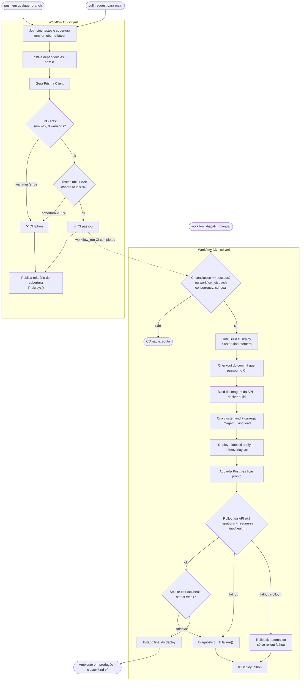

# Diagrama Fluxo de Deploy — CI → CD

```mermaid
flowchart TD
    evPush([push em qualquer branch])
    evPR([pull_request para main])
    evDispatch([workflow_dispatch manual])

    subgraph CI["Workflow CI · ci.yml"]
        direction TB
        ciJob["Job: Lint, testes e cobertura<br/>runs-on ubuntu-latest"]
        ciInstall["Instala dependências · npm ci"]
        ciPrisma["Gera Prisma Client"]
        gateLint{"Lint · lint:ci<br/>sem --fix, 0 warnings?"}
        gateTest{"Testes unit + e2e<br/>cobertura ≥ 80%?"}
        ciCov["Publica relatório de cobertura<br/>if: always()"]
        ciFail["❌ CI falhou"]
        ciOk["✅ CI passou"]
    end

    evPush --> ciJob
    evPR --> ciJob
    ciJob --> ciInstall --> ciPrisma --> gateLint
    gateLint -->|"warnings/erros"| ciFail
    gateLint -->|ok| gateTest
    gateTest -->|"cobertura < 80%"| ciFail
    gateTest -->|ok| ciOk
    ciFail --> ciCov
    ciOk --> ciCov

    ciOk -. workflow_run CI completed .-> gateCD

    subgraph CD["Workflow CD · cd.yml"]
        direction TB
        gateCD{"CI conclusion == success?<br/>ou workflow_dispatch<br/>concurrency: cd-local"}
        cdSkip([CD não executa])
        cdJob["Job: Build e Deploy<br/>cluster kind efêmero"]
        cdCheckout["Checkout do commit que passou no CI"]
        cdBuild["Build da imagem da API · docker build"]
        cdKind["Cria cluster kind + carrega imagem · kind load"]
        cdApply["Deploy · kubectl apply -k k8s/overlays/ci"]
        cdPg["Aguarda Postgres ficar pronto"]
        gateRollout{"Rollout da API ok?<br/>migrations + readiness /api/health"}
        gateSmoke{"Smoke test /api/health<br/>status == ok?"}
        cdState["Estado final do deploy"]
        cdDiag["Diagnóstico · if: failure()"]
        cdRollback["Rollback automático<br/>só se rollout falhou"]
        cdFail["❌ Deploy falhou"]
    end

    evDispatch --> gateCD
    gateCD -->|não| cdSkip
    gateCD -->|sim| cdJob
    cdJob --> cdCheckout --> cdBuild --> cdKind --> cdApply --> cdPg --> gateRollout
    gateRollout -->|ok| gateSmoke
    gateRollout -->|falhou| cdDiag
    gateRollout -->|"falhou (rollout)"| cdRollback
    gateSmoke -->|falhou| cdDiag
    gateSmoke -->|ok| cdState
    cdDiag --> cdFail
    cdRollback --> cdFail
    cdState --> prod([Ambiente em produção · cluster kind ✅])
```
