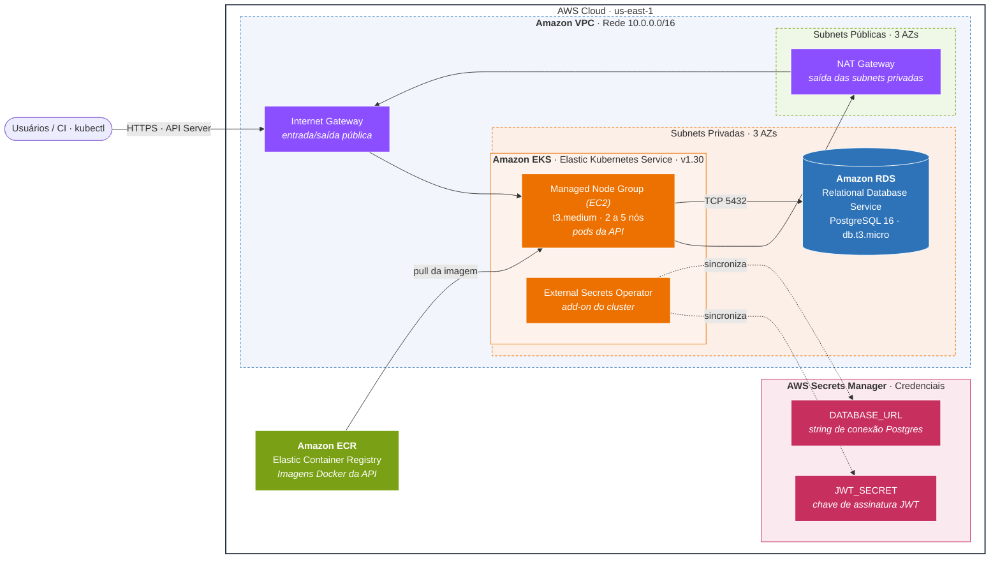

# Diagrama da Infraestrutura (Terraform)

```mermaid
graph LR
    Users([Usuários / CI · kubectl])

    subgraph AWS["AWS Cloud · us-east-1"]
        direction LR

        ECR["<b>Amazon ECR</b><br/>Elastic Container Registry<br/><i>Imagens Docker da API</i>"]

        subgraph SM["<b>AWS Secrets Manager</b> · Credenciais"]
            direction TB
            JWT["JWT_SECRET<br/><i>chave de assinatura JWT</i>"]
            DBURL["DATABASE_URL<br/><i>string de conexão Postgres</i>"]
        end

        subgraph VPC["<b>Amazon VPC</b> · Rede 10.0.0.0/16"]
            direction LR
            IGW["Internet Gateway<br/><i>entrada/saída pública</i>"]

            subgraph PUB["Subnets Públicas · 3 AZs"]
                NAT["NAT Gateway<br/><i>saída das subnets privadas</i>"]
            end

            subgraph PRIV["Subnets Privadas · 3 AZs"]
                direction TB
                subgraph EKS["<b>Amazon EKS</b> · Elastic Kubernetes Service · v1.30"]
                    direction TB
                    NODES["Managed Node Group <i>(EC2)</i><br/>t3.medium · 2 a 5 nós<br/><i>pods da API</i>"]
                    ESO["External Secrets Operator<br/><i>add-on do cluster</i>"]
                end
                RDS[("<b>Amazon RDS</b><br/>Relational Database Service<br/>PostgreSQL 16 · db.t3.micro")]
            end
        end
    end

    Users -->|HTTPS · API Server| IGW
    IGW --> NODES
    NODES --> NAT
    NAT --> IGW
    ECR -->|pull da imagem| NODES
    NODES -->|TCP 5432| RDS
    ESO -.->|sincroniza| JWT
    ESO -.->|sincroniza| DBURL

    classDef compute fill:#ED7100,stroke:#fff,color:#fff
    classDef db fill:#2E73B8,stroke:#fff,color:#fff
    classDef security fill:#C7305E,stroke:#fff,color:#fff
    classDef storage fill:#7AA116,stroke:#fff,color:#fff
    classDef net fill:#8C4FFF,stroke:#fff,color:#fff

    class NODES,ESO compute
    class RDS db
    class JWT,DBURL security
    class ECR storage
    class IGW,NAT net

    style AWS fill:#fff,stroke:#232F3E,stroke-width:2px
    style VPC fill:#F2F6FC,stroke:#2E73B8,stroke-dasharray:4 3
    style PUB fill:#EFF8E7,stroke:#7AA116,stroke-dasharray:4 3
    style PRIV fill:#FBEFE7,stroke:#ED7100,stroke-dasharray:4 3
    style EKS fill:#FDF3EC,stroke:#ED7100
    style SM fill:#FBE9F0,stroke:#C7305E
```
