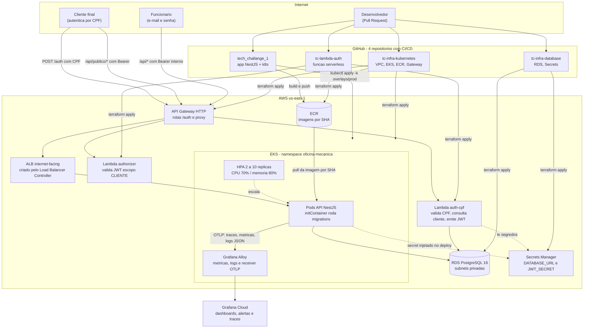

# Diagrama de Componentes — Fase 3

Visão de nuvem completa: entrada pelo API Gateway, autenticação serverless, aplicação em
Kubernetes, banco gerenciado, segredos e observabilidade — com os quatro repositórios e
suas esteiras.

## Ordem de provisionamento

`tc-infra-kubernetes` → `tc-infra-database` → `tc-lambda-auth` → deploy da aplicação →
stack `gateway/`. A destruição segue a ordem inversa. O gateway é o último porque
referencia o ALB, que só existe depois que a aplicação é implantada (ver ADR 002).

## Fronteiras de segurança

- Rotas `/api/publico/*` são validadas **duas vezes**: no Lambda authorizer do gateway e
  novamente pelo `ClienteJwtGuard` na aplicação.
- O RDS não é acessível pela internet: só os security groups dos nós do EKS e da Lambda
  alcançam a porta 5432.
- Nenhuma credencial estática nos repositórios — as esteiras autenticam por OIDC e os
  segredos vêm do Secrets Manager.
