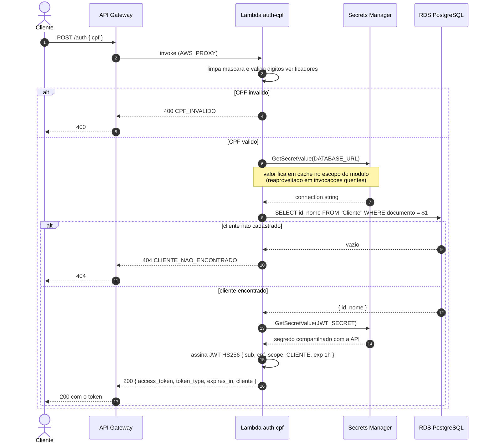
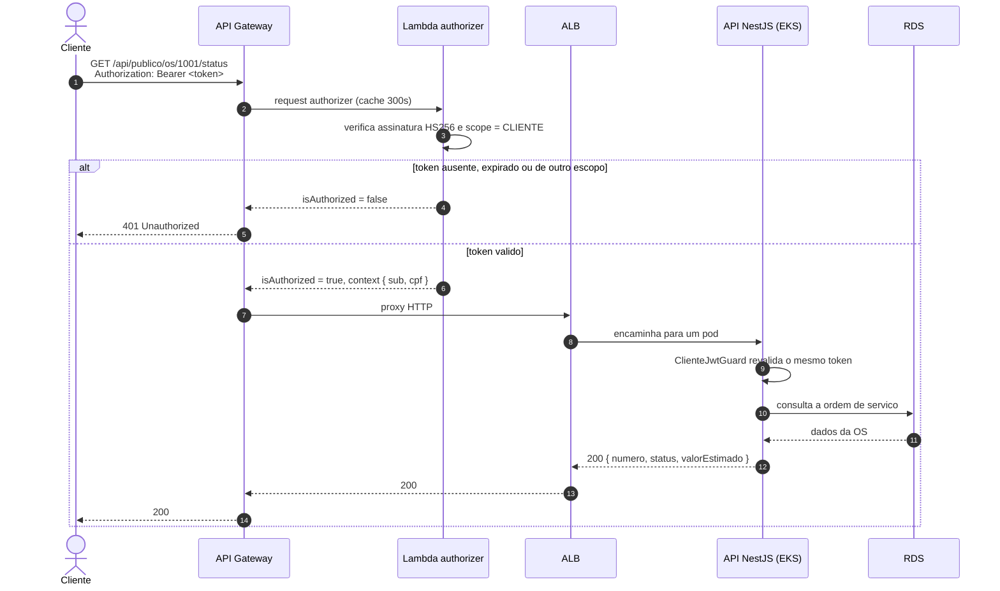

# Diagrama de Sequência — Autenticação por CPF

## 1. Emissão do token

O cliente informa o CPF; a função serverless executa as três etapas exigidas (validar,
consultar, emitir) e devolve um JWT de escopo `CLIENTE` válido por uma hora.

## 2. Uso do token em rota protegida

O token é validado no gateway e novamente na aplicação (defesa em profundidade — ADR 002).

